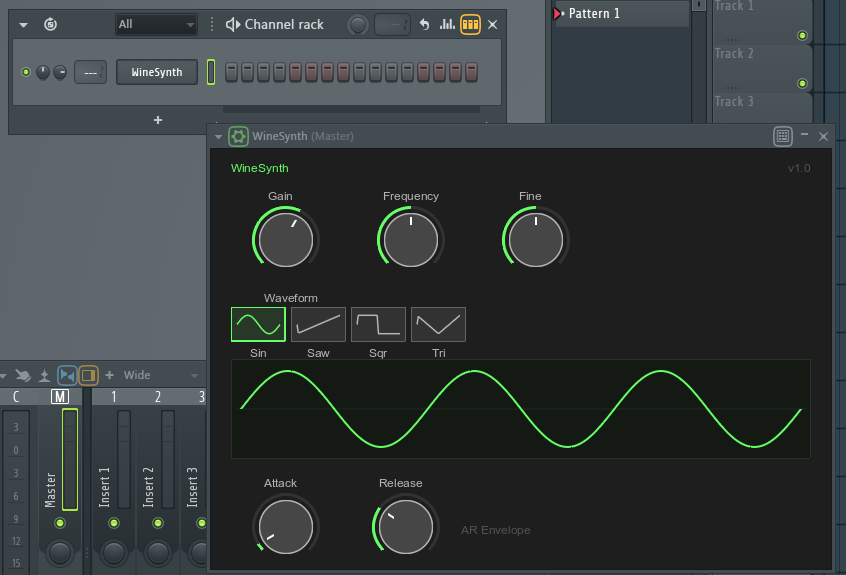

# WineSynth

Demo synthesizer (mono oscillator) built as a VST3 plugin to showcase the [MinGW cross-compilation toolchain](vstgui-vst3-wine-toolchain.md) for VSTGUI/VST3 on Linux, running in DAWs under [Wine](https://www.winehq.org/).



## Prerequisites

- **MinGW-w64** (`x86_64-w64-mingw32-g++`)
- **CMake** 3.25+
- **VST3 SDK** with VSTGUI
- **VSTGUI Fork** for MinGW cross-compilation: [giang17/vstgui](https://github.com/giang17/vstgui) (branch `feature/mingw-cross-compilation`)

For the full toolchain setup see [vstgui-vst3-wine-toolchain.md](vstgui-vst3-wine-toolchain.md).

## Build

```bash
cd winesynth
mkdir build-mingw && cd build-mingw
cmake .. -DCMAKE_TOOLCHAIN_FILE=../mingw-w64-toolchain.cmake -DCMAKE_BUILD_TYPE=Release
cmake --build . --target winesynth -j$(nproc)
```

Note: `attrib` errors (Error 127) during the build are harmless -- the DLL is linked successfully regardless.

## Deploy

```bash
# Create VST3 bundle
mkdir -p "WineSynth.vst3/Contents/x86_64-win"
mkdir -p "WineSynth.vst3/Contents/Resources"
cp VST3/winesynth.vst3 "WineSynth.vst3/Contents/x86_64-win/"
cp ../resources/moduleinfo.json "WineSynth.vst3/Contents/Resources/"

# Copy to Wine VST3 directory
cp -r "WineSynth.vst3" ~/.wine/drive_c/Program\ Files/Common\ Files/VST3/
```

The `moduleinfo.json` is required for DAW plugin discovery. Without it, hosts may not recognize the plugin.

## Wine-specific Fixes

Several workarounds are needed for VSTGUI plugins running under Wine:

- **DirectComposition disabled** -- Wine does not implement DirectComposition; without this fix the plugin hangs ~10s on open
- **Deferred initial redraw** -- D2D1 RenderTarget is not ready on the first `WM_PAINT` under Wine; a delayed `invalid()` after 100ms forces a clean repaint
- **Deferred display updates** -- Simultaneous invalidation of knobs and the waveform display causes black rectangles under Wine; a `CVSTGUITimer` (66ms) buffers updates
- **Explicit background clear** -- Custom `CControl` views must fill their background on every `draw()` call to avoid black artifacts

## Tested with

- **REAPER** under Wine 11.0/11.1
- **FL Studio** under Wine 11.0/11.1

## License

MIT
